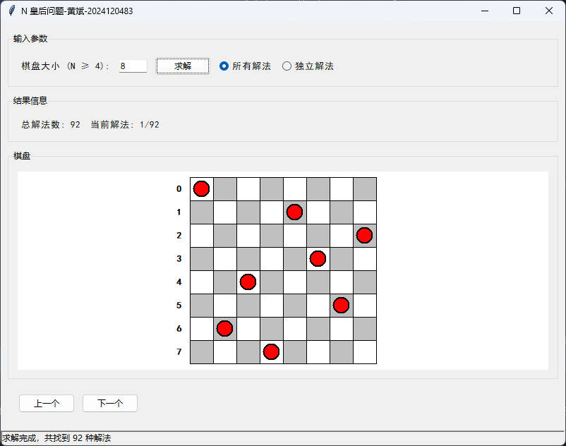
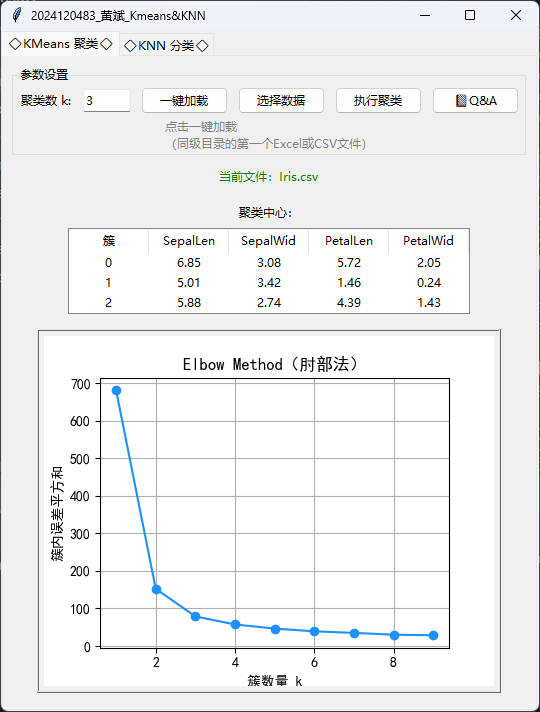
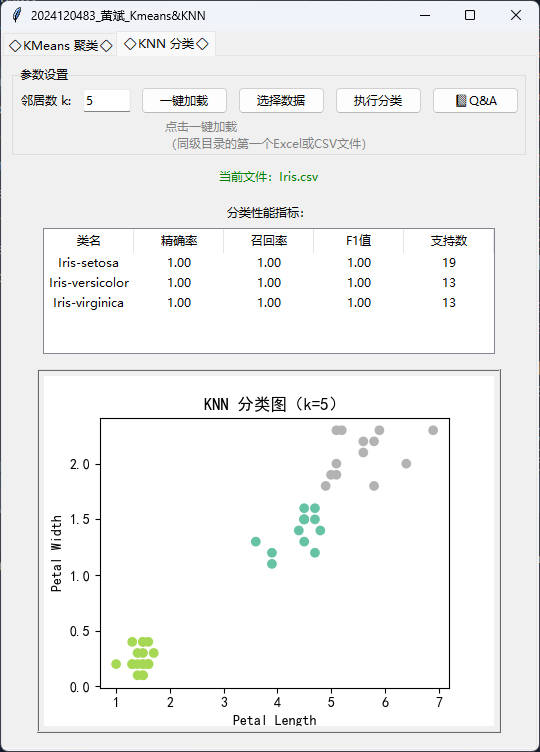

## 🎯 项目概览

- 这是一个用于管理HIT人工智能二学位的《人工智能编程实践》课程中所有作业的综合性仓库。每个作业以独立模块形式组织，涵盖算法设计、数据可视化、GUI 应用开发等内容，旨在将理论知识转化为实践能力。
- 时间不足、能力不足、粗糙完成
---

## 🧠 目录

### ✅ No1_nQueens：N 皇后问题求解器
- 基于回溯算法实现任意规模的皇后摆放
- 图形化展示解法过程与摆放效果
- 支持用户输入 `n` 并实时显示结果

### ✅ No2_KMeans_KNN：可视化数据分析平台
- 聚类分析：KMeans + Elbow Method（肘部法）图形辅助选择 `k`
- 分类识别：KNN 分类器 + 性能指标分析
- 支持 Excel/CSV 数据加载，界面交互友好
- 内置 Q&A 学习提示，便于理解算法原理


## 🛠 使用说明

运行方式（以任意模块为例）：

```bash
cd No2_KMeans_KNN
python Kmeans_KNN.py
```

---

## 📦 依赖环境

使用 pip 安装以下依赖：

```bash
pip install -r requirements.txt
```

---

## 🖼️ 软件界面截图

### ♟️ No1_nQueens 解法可视化


### 📊 KMeans & KNN 主界面


### 🔍 聚类或分类结果图展示



---

## 🚀 启动方式

在终端或 PyCharm 中运行：

---

## 👨‍🎓 作者信息

> 👤 Branko
> 🎓 HIT | 2025 二学位人工智能编程实践课程项目  
> 🗂️ GitHub: [@Branko6668](https://github.com/Branko6668)


---

## 📜 License

本项目仅用于课程学习作业记录。


